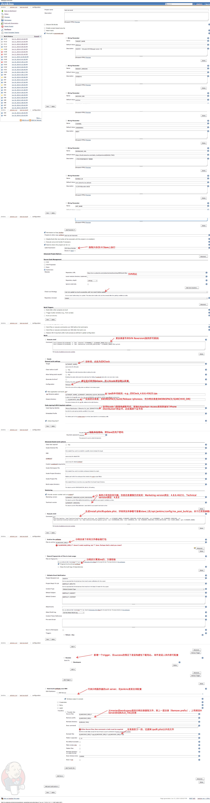
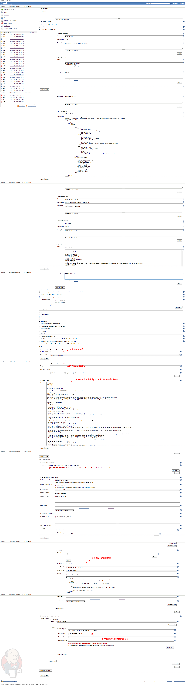

#iOS持续集成部署文档
## 说明
此文档基于在Jenkins上部署iOS项目持续集成整理而成。

## 适用范围
正点时空所有使用Xcode 5作为IDE的iOS项目。

## 系统要求
1. Jenkins Master，可以是任意部署了[Jenkins](http://jenkins-ci.org)持续集成系统的机器
2. Jenkins Slave with Mac OS X

## Jenkins相关
### 版本
Jenkins ver. 1.554.1

### 插件
| 名称        | 版本           | 说明  |
| ------------- |-------------| -----|
|Copy Artifact Plugin|1.30|复制上游项目的构建结果到下游项目的工作目录，用于`构建全渠道`|
|Email Extension Plugin|1.2|相比自带的邮件插件，这个可以根据不同的构建状态（成功、失败、不稳定）发送不同的邮件给不同的人，并支持html格式的邮件|
|Publish Over SSH|1.11|将构建出来的包上传到归档服务器|
|Parameterized Trigger plugin|2.25|传递构建参数到下游项目|
|Xcode integration|1.4.2|Xcode构建插件|

## OSX Slave
### 应用及版本
| 名称        | 版本           | 说明  |
| ------------- |-------------| -----|
|OS X|10.9.3|系统|
|Xcode|5.1.1|Xcode|
|iOS SDK|7.1|构建用的SDK|
|Python|2.7.5|...|

## 构建步骤
### 通用
1. 在slave上创建工作目录 /opt/jenkins，目录结构如下
```
	├── config
	│   ├── appleid//appid密码
	│   ├── install.plist//安装plist的模板
	│   ├── ios_post_build.py//生成install.plist和update.plist的脚本
	│   ├── mail_body_template//@deprecated，以前用来发送邮件的模板，现在使用插件，所以配置在ci上
	│   ├── svn//svn账号密码
	│   ├── update.plist//更新plist的模板
	│   ├── zdclock_build_info//@deprecated，以前的构建配置文件
	│   └── zdclock_daily_build_ios.mobileprovision//设备描述文件，Xcode 5以后不用手动选择
	├── connect_master.sh//slave链接master的脚本，使用jnlp
	└── workspace
	    └── workspace // 工作目录
	        ├── test-ios-all-channels //全渠道测试下游项目，解压母包，更改配置后重新打包
	        ├── test-ios-build // 每日构建测试项目
	        └── test-ios-template // 全渠道测试上游项目，构建渠道号为开发渠道号的母包
```
2. Jenkins->Manage Jenkins->Manage Nodes，新建一个节点，可以依据需求定制。目前选择的链接方式是：Launch slave agents via Java Web Start，好处是Slave机器的ip可以是动态的，坏处是Slave出问题后Master无法检测出相关问题。
3. 新建节点后，如果选择的是“Launch slave agents via Java Web Start”，进入节点页面会提示使用类似如下的命令链接Master:```javaws http://ci.s.zdworks.com/jenkins/computer/iOS-Slave-Builder/slave-agent.jnlp```

运行/opt/jenkins/connect_master.sh， 使得在http://ci.s.zdworks.com/jenkins/computer出现

### 每日构建
参看[test-ios-build](http://ci.s.zdworks.com/jenkins/view/zdclock_ios/job/test-ios-build)，相关配置和说明见图：

### 全渠道
#### 上游项目
上游项目参看每日构建，唯一的区别是增加了一条`Trigger parameterized build on other project`来触发下游项目的构建及传递参数，参看[test-ios-template](http://ci.s.zdworks.com/jenkins/view/zdclock_ios/job/test-ios-template)

#### 下游项目
参看[test-ios-all-channels](http://ci.s.zdworks.com/jenkins/job/test-ios-all-channels/)，相关配置和说明见图：